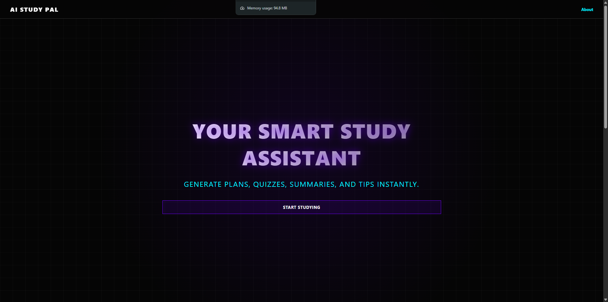
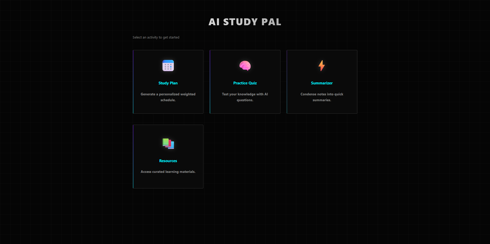
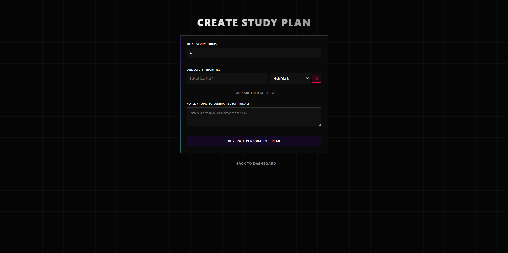
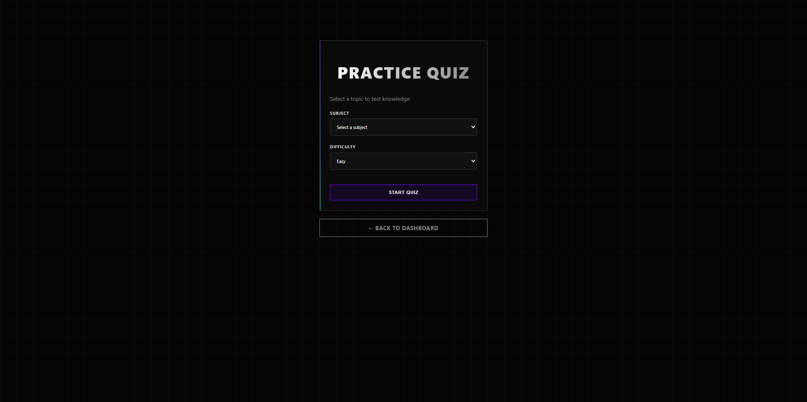
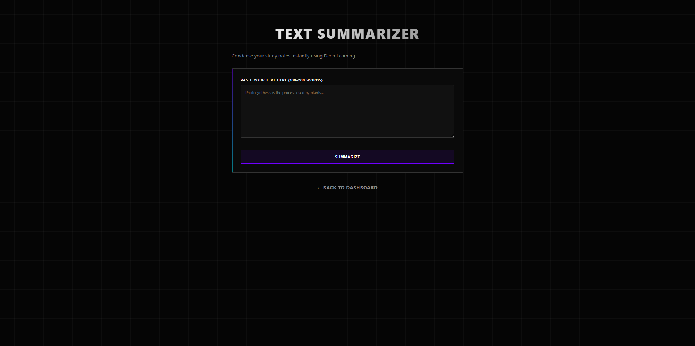
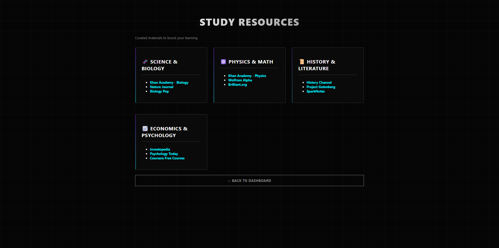

### 🚀 LaunchedGlobal Capstone Project — AI-Powered Study Assistant

**AI Study Pal** is an end-to-end Artificial Intelligence web application that demonstrates the real-world application of **Machine Learning, Deep Learning, Natural Language Processing, and Full-Stack development**.
The project is built to solve a practical problem **personalized academic assistance** using production-style architecture and clean UI design.

> 🎯 **Recruiter takeaway:** This project showcases applied AI, model integration, data handling, and deployment-ready Flask architecture in one complete system.

---

## 👤 Author

- **GitHub Username:** rithvikk05
- **GitHub Profile:** [https://github.com/rithvikk05]

---

## 🧩 Problem Statement

Students often struggle with:

* Planning study time efficiently
* Revising large volumes of text
* Testing conceptual understanding
* Finding reliable learning resources

AI Study Pal addresses these challenges by combining **AI-driven automation** with an intuitive user interface.

---

## 💡 Solution Overview

AI Study Pal provides:

* Personalized study plans
* AI-generated quizzes
* Deep Learning–based text summarization
* NLP-driven study tips
* Curated educational resources

All features are accessible through a unified Flask web application.

---

## ✨ Key Features (Recruiter-Focused)

* **Personalized Study Planning**
  Weighted time allocation using user-defined priorities.

* **Machine Learning Quiz Engine**
  Logistic Regression for difficulty classification and K-Means clustering for topic grouping.

* **Deep Learning Text Summarization**
  Neural network–based summarization for condensing academic notes.

* **Natural Language Processing (NLP)**
  Tokenization and keyword extraction using NLTK.

* **Production-Style Web App**
  Flask backend with modular templates and clean UI.

---

## 🧠 AI & ML Techniques Used

| Area                | Technique                        |
| ------------------- | -------------------------------- |
| Quiz Classification | Logistic Regression              |
| Topic Grouping      | K-Means Clustering               |
| Text Summarization  | LSTM / Seq2Seq (Keras)           |
| NLP Processing      | Tokenization, Keyword Extraction |
| Data Handling       | Pandas                           |

---

## 🛠 Technology Stack

### Programming & Backend

* Python 3.x
* Flask

### Data & AI

* Pandas
* Scikit-learn
* TensorFlow / Keras
* NLTK

### Frontend

* HTML5
* CSS3 (Dark UI, Glassmorphism)

---

## 🧱 System Architecture

```
User Interface (HTML/CSS)
        ↓
Flask Web Server
        ↓
AI Modules
  ├─ Study Planner
  ├─ Quiz Generator (ML)
  ├─ Text Summarizer (DL)
  └─ NLP Study Tips
        ↓
Model Persistence & Dataset
```

---

## 🖼 Screenshots

> *Screenshots reflect actual application UI and workflow*

* 
* 
* 
* 
* 
* 

(Stored under `/screenshots` directory)

---

## 📂 Project Structure

```
LaunchedGlobal Capstone Project/
├── app.py
├── requirements.txt
├── dataset.csv
├── models/
│   ├── quiz_generator.pkl
│   └── summarizer.h5
├── templates/
├── static/
└── README.md
```

---

## 📍 File Locations

Key files and directories are located as follows in the repository:

- **Main application file:** `app.py` (root directory)
- **Dependencies:** `requirements.txt` (root directory)
- **Dataset:** `dataset.csv` (root directory)
- **Trained models:** `models/` directory (contains `quiz_generator.pkl` and `summarizer.h5`)
- **HTML templates:** `templates/` directory
- **Static assets (CSS, JS, images):** `static/` directory
- **Project documentation:** `README.md` (root directory)

---

## ⚙️ Setup & Installation

### Prerequisites

* Python 3.6+
* pip

### Installation

```bash
git clone https://github.com/Rithvikk05/Capstone-Project.git

cd Capstone-Project

pip install -r requirements.txt
```

### Run Application

```bash
python app.py
```

Open browser:

```
http://localhost:5000
```

---

## 🧪 Model Training & Automation

* Models are **auto-trained on first run** if missing
* Saved locally for reuse
* Ensures reproducibility and ease of setup

---

## 📊 Evaluation Metrics

* **ML Models:** Accuracy, basic classification metrics
* **DL Models:** Human-evaluated summary quality
* **Web App:** Usability and clarity

---

## 🔐 Ethics & Data Privacy

* No personal data storage
* No third-party APIs
* Local model execution only
* Educational use-case focused

---

## 🎓 Skills Demonstrated (For Placements)

* Machine Learning (Supervised & Unsupervised)
* Deep Learning with Keras
* Natural Language Processing
* Data Preprocessing & Feature Engineering
* Flask Web Development
* End-to-End AI System Design
* Model Persistence & Automation
* UI/UX Awareness

---

## 🧑‍💼 Recruiter Notes

* ✔ Demonstrates **practical AI application**
* ✔ Combines **ML, DL, NLP, and Web Development**
* ✔ Clean project structure and documentation
* ✔ Suitable for **AI Engineer / Data Scientist / ML Engineer roles**

---

## 📌 Future Enhancements

* User authentication
* Performance analytics dashboard
* Transformer-based summarization
* Cloud deployment (AWS / Azure)

---

## 📄 License

Educational use only.
